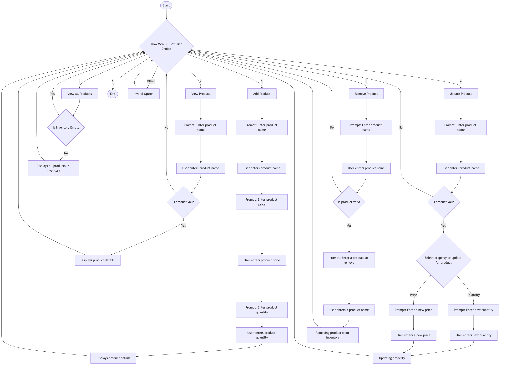

# Console App Inventory Management System

Simple C# console app that allows users to manage product stock.

## Features

- Adding products with name, stock quantity and price.
- Update stock when products are sold or restocked.
- View all products and their stock levels.
- Remove products from inventory.

## Flowchart

